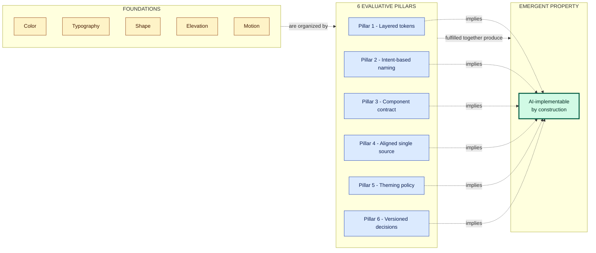

# AI-implementable as an emergent property

---

Companion doc to `design-system-pillars.md`. There, the 6 pillars are presented as evaluation criteria for a DS aimed at humans. Here, the angle is different: **a DS that fulfills the 6 pillars is, by construction, implementable by an agent** — without needing more explicit rules. AI-implementable is not a separate pillar. It's an emergent property.

Reading prerequisite: you need to know the vocabulary and the 6 pillars from `design-system-pillars.md` (or an equivalent). This doc doesn't redefine the terms.

---

## Thesis

The 6 pillars were designed for human problems: cheap rebranding, dark mode without a refactor, detectable drift, an auditable contract. **The surprise is that those same pillars are exactly what an AI agent needs to generate consistent code from a design.** It's not a coincidence: both "consumers" (human dev and agent) need the same invariants — names that carry intent, layers that isolate change, a 1:1 contract, queryable decisions.

That's why "AI-implementable" isn't a separate goal. It's a **diagnostic** of a quality that has always mattered. The difference is that AI makes that diagnostic more visible, faster, cheaper.

---

## What an agent needs, in order

An AI agent generating code from Figma needs, in sequence:

1. Identify which code component corresponds to the Figma component. **(solved by: pillar 4 — Code Connect mapping)**
2. Know which value to use where — text in what color? **(solved by: pillar 1 — layers, and pillar 2 — semantic names)**
3. Not overwrite existing variants or invent new ones. **(solved by: pillar 3 — contract)**
4. Know whether a color responds to Light/Dark. **(solved by: pillar 5 — theming policy)**
5. Not recreate tokens that already exist. **(solved by: pillar 4 — drift detection flags hardcodes)**
6. Know why a token exists when it needs to decide whether to keep or replace it. **(solved by: pillar 6 — decisions)**

Each item below unpacks how the corresponding pillar delivers this.

---

## Pillar 1 — Layered tokens → the agent knows which layer to bind to

Without layers, the agent sees `#EF4444` in Figma and has three choices: bind `red-500` in the component, create an ad-hoc class, or hardcode it. All wrong.

With layers, the agent sees the bound token (`theme.primary`) in Figma, finds `theme.primary` in the CSS, and binds it in the component. A mechanical decision.

Without pillar 1, agents generate code that "works visually" but breaks the DS — multiplying exactly the work the DS was supposed to prevent.

---

## Pillar 2 — Intent-based naming → the agent doesn't confuse appearance with purpose

The agent reads "primary" and knows it's the brand's main color, regardless of hue. It reads "destructive" and knows it's a destructive action. It doesn't confuse it with "blue" — because the name doesn't say "blue".

When the agent needs to decide "is this button primary or cta?", it looks at Figma, sees the applied token, and replicates it. No inference about hue.

Pillar 2 keeps the agent from falling into traps like "there's `error-red`, I'll use it for error status" — without knowing the team uses `destructive` for that and `error-red` is just a primitive.

---

## Pillar 3 — Component contract → the agent generates correct variants

The agent sees `<Button variant="primary" size="md">` in Figma. To generate code, it needs that contract to exist 1:1 in React. Pillar 3 guarantees it.

Without pillar 3, the agent will: try `variant="primary"` (doesn't exist in code), infer `className="btn-primary"` (not conventional), or generate inline styles. Inconsistent output.

With pillar 3, the mapping is direct.

Default a11y (accessibility) is particularly important: the agent rarely remembers to add `:focus-visible` correctly. If the component already has it by default, the agent doesn't even need to think about it.

---

## Pillar 4 — Aligned single source → the agent detects its own drift

Freshly generated agent code: "I'll use `#FFFFFF` here". Hardcoded scanner in CI: "❌ hardcoded in component". Agent rewrites using `surface-default`. Self-correction.

Without a detector, the agent accumulates hardcodes and nobody notices. The DS degrades slowly.

More subtly: Code Connect mapping lets the agent, when reading a Figma frame, know which code component corresponds to it — without needing to infer from the name (`Card.tsx` could be anything). Deterministic output instead of a guess.

---

## Pillar 5 — Explicit theming policy → the agent knows when to apply theme

The agent sees a color in Figma. Is it bound to `theme.surface-default`? Apply theme. Is it hardcoded `#000`? It could be a theme-independent zone (correct to keep it hardcoded) or it could be a bug (should be theme).

An explicit theming policy gives the agent the rule: "is this zone theme-independent? check the doc. Yes? keep it hardcoded. No? bind theme."

Without a policy, the agent does the wrong thing with equal confidence in both cases.

---

## Pillar 6 — Versioned decisions → the agent retrieves context without hallucinating

The agent is working on a component. It finds a strange token (`theme.cta-secondary`). It asks: why does this token exist?

With a decision log, the agent reads: "TD-23: theme.cta-secondary created on 2026-04-12 to support seasonal campaigns without touching primary." Mechanical decision: preserve it.

Without a decision log, the agent either: ignores it (perpetuating the token), hallucinates a reason ("probably the brand's dark mode"), or suggests removing it ("looks like a duplicate of primary"). Wrong in varying proportions.

Pillar 6 turns "why" from guesswork into a prose lookup. The agent retrieves context without inventing it.

---

## Synthesis

```
Pillar 1 → layer to bind to
Pillar 2 → semantic name avoids confusion
Pillar 3 → 1:1 contract
Pillar 4 → drift detected and corrected
Pillar 5 → theme applied when it should be
Pillar 6 → queryable decisions
```

Visually, the relationship foundations → pillars → emergent property:



---

## The ultimate test

**Given only the DS documentation (no human-in-the-loop, no in-person onboarding), can a competent agent implement a feature using the correct components, the correct tokens, with the correct states, and respecting theming?**

If yes, the DS fulfills the 6 pillars. If not, there's a weak pillar — and that's where to invest.

This test holds **even before thinking about AI**. A DS that satisfies this criterion is also a DS where junior devs produce consistent code, new designers use the correct tokens, and the product doesn't diverge under deadline pressure. AI is the **extreme case** of the same criterion: zero human context, pure reading of the DS.

That's why AI-implementable isn't a new goal — it's a diagnostic of a quality that has always mattered. The difference is that AI now makes that diagnostic more visible, faster, cheaper.

---

## Where to go next

- **`design-system-pillars.md`** — the parent doc, with the 6 pillars explained in depth.
- **Code Connect (Figma)** — `figma.com/code-connect` — declarative Figma↔code mechanism that reduces pillar 4 friction when AI is part of the flow.
- **MCP servers for Figma** — tools like the Figma Dev Mode MCP expose `get_code_connect_map`, `get_design_context`, `get_screenshot`. Without explicit Code Connect, the pipeline still works via consistent naming + these contexts.
