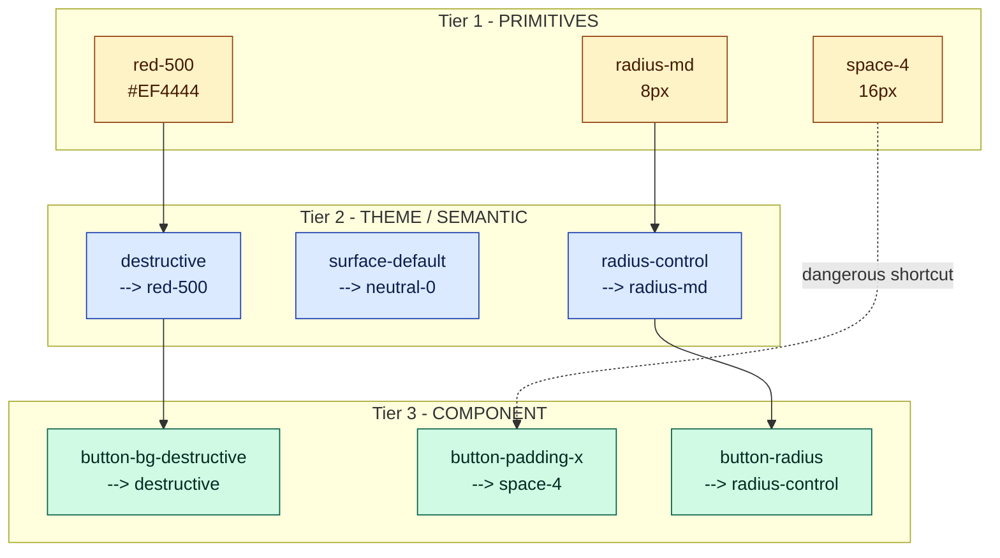
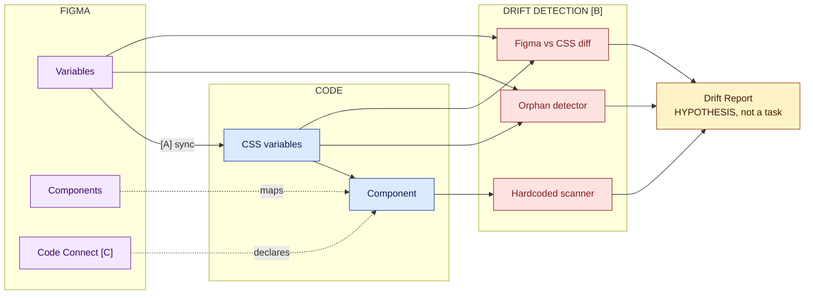
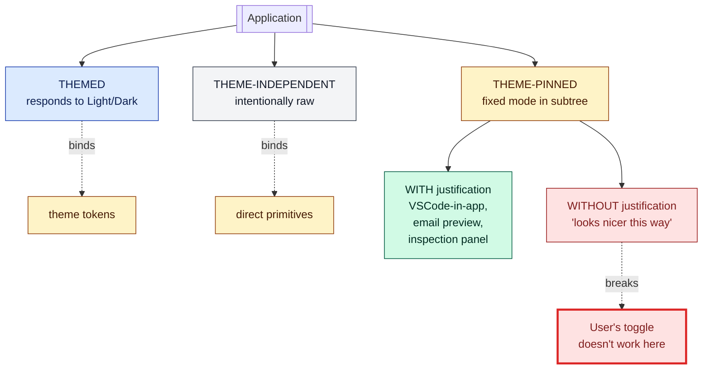
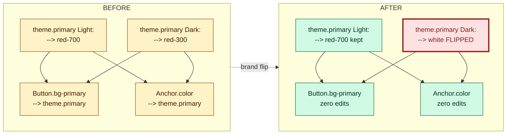

# Pillars of a Good Design System

---

## Preface

Practical, short guide: you read it in one sitting, get the hang of DS, and become able to **evaluate** an existing DS (yours, a client's, a public library's) with precise words. It's not "looks like a good DS" — it's "this DS fails pillar 4 because X".

### How to read

- **Beginner** — read in order; Part 1 fixes vocabulary.
- **Already know HTML/CSS** — skip to Part 3 (pillars + checklists) and Part 3.5 (layout smells).
- **Just want to audit** — read the 6 checklists in Part 3, all of Part 3.5, and the case study in Part 4.

Companion: [design-system-ai-implementable.md](docs/design-system-ai-implementable.md) covers the angle "a good DS is, by construction, AI-implementable". Not a prerequisite; this doc stands alone.

---

## Part 1 — Vocabulary

### 1.1 Why vocabulary matters

Discussing DS without shared vocabulary turns into opinion — "that color looks weird", "that button should be bigger". With vocabulary, it becomes argument — "that button uses `red-500` directly instead of `destructive`; it breaks pillar 1 and makes rebranding cost N edits".

Most DS fights are bad vocabulary, not bad design.

### 1.2 Essential terms

**Token / Variable.** Token is the concept (`name → value`). Variable is the incarnation in a tool: Figma Variable, CSS Custom Property, JS object key. Not every variable is a token — `--header-height-on-mobile-landscape: 48px` ad-hoc in a component is a local variable. Token implies reuse and governance.

**Primitive.** Raw value, no semantics. `red-500 = #EF4444`, `space-4 = 16px`, `radius-md = 8px`. It's the DS's alphabet.

**Semantic / Theme token (alias).** Token that points to another, carrying intent. `destructive → red-500`. The raw value is the same; what changes is the usage promise. Theme token, alias, semantic token are, in this doc, synonyms. DTCG calls it "alias", other DSs call it "system token" — identical concept.

The difference between primitive and semantic is what makes rebranding cheap vs. expensive. If you rename `red-500` in the component, you swap it component by component. If you swap the alias, you edit one line.

**Component-scope token.** Internal to the component. `button-padding-x → space-4`, `button-bg-destructive → destructive`. Third layer — doesn't pollute the global table.

**Slot.** Extension point. `<Button leadingIcon={<DownloadIcon/>}>` — `leadingIcon` is a slot. **`asChild`** (Radix UI) takes the concept further: the component hands its semantics to the child, avoiding a wrapper. Useful for `<Button asChild><Link href="...">Go</Link></Button>` — becomes a link while keeping button styling. Dominant pattern in Radix, shadcn/ui, Headless UI.

**Variant.** Discrete axis of the contract. `size: sm|md|lg`, `variant: primary|secondary|destructive`. It's the **visible contract**. When Figma and code diverge on values, there's contract drift (pillar 3).

**State.** Run-time state: `default`, `hover`, `focus`, `active`, `disabled`, `loading`. Different from variant because it's not chosen by the dev — it's determined by the browser / interaction. In Figma these are usually explicit variants (`state=hover`); in code, pseudo-classes (`:hover`, `:focus-visible`) or data attributes.

**Binding.** Token ↔ visual property link. In Figma: `Rectangle.fills` bound to `theme.surface-default`. In code: `background-color: var(--surface-default)`. Most DS bugs are missing bindings, at the wrong layer, or stuck.

**Drift.** Divergence between design and implementation. **Value** drift (Figma says `#DC2626`, code says `#DD2222`), **structure** drift (Figma has `size=lg`, code doesn't), or **state** drift (Figma has `:focus` designed, code doesn't have `:focus-visible`). A good DS doesn't avoid drift; it **detects** drift.

**Revision vs Supersede.** Model for decision history. Revision: a parameter changed, but the choice ("Option letter") remains. Supersede: the choice changed. Binary discriminator: did the Option letter change? Yes → Supersede. No → Revision.

**Code Connect.** Figma mechanism to declaratively map a Figma component → a code component (`Component X is that <Button>`). Reduces friction for AI generating code that respects the DS. Without Code Connect, AI relies on consistent naming + Figma Dev Mode MCP — it works, but is less deterministic.

---

## Part 2 — Foundations

Foundations are the DS's **raw material**: color, typography, shape, elevation, motion. Before evaluating how a DS organizes raw material (Part 3), you need to know what that raw material is.

> **Note.** This part cites Tailwind, Carbon, Radix, shadcn/ui as reference. **Reference ≠ prescription.** Copying an entire public DS because "it's canon" is a common mistake, not conservatism. Use it as vocabulary; choose the subset that makes sense for your product.

### 2.1 Color

Color is the densest foundation — it concentrates ~50-70% of tokens and most drift bugs. Worth the time.

**Color ramp.** Ordered sequence of tones: `red-50, red-100, ..., red-900, red-950` (Tailwind convention, 11 tones). Radix Colors uses 12 named by functional role (`solid`, `border`, `text-low-contrast`); Carbon uses 10. Fewer than ~10 falls short; more than ~13 becomes noise. **For a new DS, copying the Tailwind convention has the least friction.**

**Which colors get a ramp?** At minimum: 1 neutral + 1 primary (brand) + 4 semantic (success, warning, danger, info). Typical total: 6-8 ramps × ~11 tones = ~70-90 primitives.

**Color spaces: HEX → HSL → OKLCH.**
- HEX: compact, terrible for generating ramps by computation.
- HSL: manipulable (`lightness - 10%` darkens) but perceptually non-uniform — 10% lightness on yellow washes it out; on blue, it darkens toward near-black.
- **OKLCH**: perceptually uniform, natively supported in CSS since 2023. Tailwind v4 default. State of the art.

```css
--red-500: #EF4444;                      /* HEX inert */
--red-500: hsl(0 84% 60%);                /* HSL inconsistent */
--red-500: oklch(0.628 0.258 27.6);       /* OKLCH uniform */
```

OKLCH caveats in legacy DS: gamut clipping in sRGB, conversion isn't visually lossless, `color-mix` in sRGB can regress. For a new DS, OKLCH; for legacy, plan a migration.

**Light/Dark as two resolutions.** In a DS that respects pillar 5, Light and Dark are **not two lists** — they're two **resolutions** of the same set of aliases:

```
theme.surface-default
  Light → neutral-0    (#FFFFFF)
  Dark  → neutral-950  (#0A0A0A)

theme.primary
  Light → red-700      Dark → red-300
```

A component binds to `theme.surface-default` once; the mode decides which primitive resolves. Watch out: **good dark mode isn't inverted light mode** — optical contrast works differently, and often requires saturation adjustment.

**Diagram: color layers.** The diagram applies to any foundation, but the main case is color. **Components consume theme (tier 2) or component-scope (tier 3), never primitives (tier 1) directly.**



The dashed arrow `space-4 -.-> button-padding-x` flags the anti-pattern: binding a primitive directly in component-scope, skipping theme.

### 2.2 Typography

Typography is where immature systems have 50 ad-hoc-named styles; mature ones have 10-15 canonical Text Styles. Widely accepted generic roster: `Display L/M/S` (hero), `Headline L/M/S` (page titles), `Title L/M/S` (card/section titles), `Body L/M/S` (reading), `Label L/M/S` (buttons, chips, micro-typography). 15 styles is the ceiling; most products use 10-13.

Each level defines `fontSize`, `lineHeight`, `letterSpacing`, `fontWeight`. In Figma it becomes a **Text Style** (`Body/M`); in code it becomes a Tailwind class or CSS.

**Why have a typescale?** Without one, each designer picks `18px` or `19px` for "subtitle" depending on the wind. With one, every subtitle is `Title/L` and changing the whole product is one edit.

**Foundation beneath the Text Style.** The Text Style also points to a **foundation token** (`fontFamily-base`, `fontWeight-medium`):

```
foundation:    fontFamily-base = 'Inter'
text-style:    Body/M (fontFamily=fontFamily-base, fontSize=16, ...)
node:          applies Body/M
```

Swapping Inter for Roboto = 1 edit in the foundation. Pillar 1 in action. **Font migration is only viable if the foundation is layered** — if you can't swap the whole product's font with 1-2 edits, your typography isn't a DS yet, it's a collection of literals.

### 2.3 Shape

"Shape" in a DS = corner radius. The most underestimated and easiest foundation to make a mess of.

```
radius-none   0    radius-md     8     radius-2xl    24
radius-xs     2    radius-lg     12    radius-full   9999
radius-sm     4    radius-xl     16
```

7-8 values. Not 30. Accept that `radius-sm` (4) or `radius-md` (8) cover 95% of cases; reject the 5% that insist on one-off values.

**Shape as a language.** A good DS codifies the relationship in theme tokens: `radius-control → radius-sm` (inputs, chips), `radius-card → radius-lg` (cards), `radius-pill → radius-full`. Then Button binds to `radius-control`, not directly to `radius-md`.

### 2.4 Elevation

Elevation = the feeling of "above". In rich (materialist-style) DSs it's as fundamental as color; in flat DSs (Tailwind-style) it appears subtly — light shadows only for overlays.

```
elevation-0   no shadow           elevation-3   menus, tooltips
elevation-1   static cards        elevation-4   modals, dialogs
elevation-2   hover/interactive   elevation-5   full-screen overlays
```

Each level resolves to a set of `box-shadow`s — usually 2 stacked (one short and dense for crispness, one long and diffuse for depth). In Dark mode, a black shadow on a dark background becomes invisible — some DSs (partially) replace shadow with **surface tint** (translucent brand layer over the surface, more intense with higher elevation). Costs extra `surface-tint-1..5` tokens; worth it if the product is dark-first.

**Why it's a foundation, not decoration.** It communicates hierarchy. Without tokens, every modal/popover/dropdown becomes an ad-hoc shadow — visual drift within weeks.

### 2.5 Motion

A foundation that only recently became first-class. In products with strong animation (mobile, expressive brand), it deserves tokens. In static enterprise apps, it's a footnote.

**Duration:** `duration-xs 80ms` (micro-states), `duration-sm 140ms` (chip/switch), `duration-md 240ms` (cards/panels), `duration-lg 400ms` (overlays).

**Easing (canonical curves):** `ease-standard cubic-bezier(0.2,0,0,1)` (general use), `ease-emphasized cubic-bezier(0.05,0.7,0.1,1)` (dramatic entrances), `ease-decelerate cubic-bezier(0,0,0,1)` (entering), `ease-accelerate cubic-bezier(0.3,0,1,1)` (exiting).

**Rule of thumb:** if an animation appears 2+ times in the product, it becomes a token.

---

## Part 3 — The 6 evaluative pillars

Each pillar follows the same format: short thesis, why, smell↔fix table, checklist. A student should be able to scan it in 60 seconds.

Mnemonic: **T-N-C-S-T-D** (Tokens, Naming, Contract, Single source, Theming, Decisions).

### Pillar 1 — Layered tokens

**Thesis.** For color, semantics is mandatory. For other domains (space, radius, duration), semantics needs a functional reason — an alias for symmetry's sake is worse than a direct primitive.

**Why.** Without layers: rebranding is a giant find-and-replace, dark mode requires editing component by component, AI doesn't know which color is "primary". With layers: rebranding edits aliases, dark mode is a second resolution, AI points to `theme.primary` and the system resolves it.

| Smell | Fix |
|---|---|
| `red-500` appears dozens of times in components | Create `theme.destructive → red-500`; bind components to `destructive` |
| Dark mode estimated at "weeks" and stalled for months | Pillar 1 is broken; refactor before attempting Dark |
| Table with >200 entries mixing primitives and aliases | Split into files: `primitives.css`, `theme.css` |
| Vague aliases like `space-md-2` (alias for symmetry) | Use a direct primitive (`space-4`) or an alias with a functional reason (`radius-control`) |
| `theme.dark.primary` (mode baked into the name) | Refactor to `theme.primary` resolving by mode |

**Checklist.**
- [ ] Is there an explicit primitives layer?
- [ ] Is there a theme layer with semantic names?
- [ ] For **color**: do components consume theme (not primitives)?
- [ ] Are Light/Dark two resolutions of the same set (not two parallel themes)?
- [ ] Is there a lint that flags a direct primitive in a component?

If ≥3 are "no", pillar 1 is in bad shape.

---

### Pillar 2 — Intent-based naming

**Thesis.** Names describe purpose, not appearance.

**Why.** If the brand turns blue tomorrow, how many tokens need renaming? **Zero**, in a good DS. A name is a contract — `brand-blue` promises "this blue color"; changing the color breaks it. `primary` promises "the brand's tone"; changing the color keeps the contract. The DS's lifespan depends on this.

| Smell | Fix |
|---|---|
| `text-light`, `text-medium`, `text-dark` (describes appearance) | `text-muted`, `text-default`, `text-strong` (hierarchy) |
| `error-red` in component code | `destructive` (intent) — `error-red` may exist only as a primitive |
| `brand-blue`, `colorBrandBlueDarkMode` | `primary`; colors live in primitives, theme names the role |
| `header-bg` (component name leaks into the token) | `surface-app-chrome` or `surface-elevated` (role, not component) |
| `text-12px` at the theme layer | `label-sm` or `text-caption` (role; size stays in the primitive) |
| `dark-mode-bg` as a token | `surface-default` resolving by mode |

**Good reference.** shadcn/ui uses 8 names (`primary`, `destructive`, `secondary`, `muted`, `accent`, `border`, `input`, `ring`) that cover 90% of usage, all by role. Polaris (Shopify) uses `bg-fill-success`, `bg-fill-critical` — role + state, not hue. Carbon (IBM) has names like `text-primary`, `support-error`, `interactive-01`.

**Checklist.**
- [ ] Do theme-layer names avoid mentioning color, concrete size, or appearance?
- [ ] Is there a clear separation: primitives name appearance, theme names intent?
- [ ] Would renaming `red-500` → `crimson-500` not require editing components?
- [ ] Is there a documented convention for new names (e.g. "use role, not color")?

---

### Pillar 3 — Component contract

**Thesis.** The same axes exist in Figma, in code, and in the story catalog. A11y (accessibility — numeronym of `a` + 11 letters + `y`) is default, not optional.

**Why.** Structural drift (`Button size="xl"` that exists in Figma but not in code) is more serious than value drift. Default a11y matters because, without it, every consumer reinvents it: one forgets focus, another forgets aria-label, another forgets the disabled state — it becomes a lottery.

| Smell | Fix |
|---|---|
| Figma has `Button/size=lg` but code doesn't | Add it in code or remove it from Figma — case by case |
| `:focus` only appears when the consumer adds `outline` | The DS component implements `:focus-visible` by default |
| Disabled is `opacity: 0.5` (falls below WCAG 4.5:1) | Tokens `text-disabled`, `bg-disabled` keeping minimum contrast |
| `<div onClick>` instead of `<button>` | Correct HTML semantics by default; use Radix/Headless UI for keyboard support |
| No `prefers-reduced-motion` | Duration tokens with conditional fallback |
| Every usage copies `aria-label="Close"` | Sensible default in the component; consumer overrides if needed |
| Stories only have the `default` state | Catalog covers each `variant × state` combination |

**WCAG 2.2** (2023): SC 2.4.11 (focus not obscured), SC 2.5.7 (dragging alternative), SC 2.5.8 (target ≥ 24×24 CSS px). A good DS in 2026 accounts for these in the contract.

**Checklist.**
- [ ] Does each Figma variant exist in code under the same name?
- [ ] Is each designed state reachable (pseudo-class or data-attr)?
- [ ] Is `:focus-visible` default, not optional?
- [ ] Does the component have correct HTML/ARIA semantics without an extra prop?
- [ ] Is there a story/test for every variant × state combination?

---

### Pillar 4 — Aligned single source (Figma ↔ code)

**Thesis.** The drift you don't measure is the drift that grows. Automation flags it, a human decides.

**Why.** Without alignment, the DS becomes folklore ("you're new, don't use that color; use that one"). Automation resolves value drift (Figma and code disagree) and coverage drift (hardcoded instead of a token).

**Important nuance:** the report is a **hypothesis, not a task.** It points out "there are 30 hardcodes here"; a human validates which ones deserve to become tokens. Treating a drift report as a blind task leads to "let's just replace everything" — and breaks things.

**Three sub-concerns with different costs:**

| Sub | What it is | Cost | ROI |
|---|---|---|---|
| **A. Figma → code sync** | Pipeline (Tokens Studio, script) that exports Figma vars as CSS vars | Medium (~3 days setup) | High if the team changes tokens frequently |
| **B. Drift detection** | CI scanners: hardcoded, orphaned, value differs | Low (~1 day) | Always high |
| **C. Code Connect mapping** | Figma↔code mapping | Medium-high (maintenance) | High if AI / Dev Mode is part of the flow |

Start with **B** (cheapest, always worth it); add A if the token cycle is dynamic; consider C as an accelerator.



| Smell | Fix |
|---|---|
| Sync happens "whenever someone remembers" | CI pipeline; a failure blocks the merge |
| Hardcoded `#FFFFFF` in component CSS | Hardcoded scanner in CI rejects it; dev uses `surface-default` |
| Orphaned tokens detected weeks ago, nobody deleted them | Scan = hypothesis — validate against Inspect output before deleting |
| Drift report ran, mass deletion happened, product broke | Treat the report as a hypothesis; cross-validate before acting |
| Documentation in a stale README | Single source isn't single if the README disagrees with the code — generate it from the code |

**Checklist.**
- [ ] Is there a pipeline (manual or auto) that exports Figma vars to code?
- [ ] Does a hardcoded scanner run in CI or pre-commit?
- [ ] Does an orphaned-token detector exist?
- [ ] Do drift reports generate an issue/alert (not just a log)?
- [ ] Does the team treat reports as hypotheses and validate before acting?

---

### Pillar 5 — Explicit theming policy

**Thesis.** Theming is a choice, not a default. Where it applies, there must be a reason. Where it doesn't, too.

**Why.** Junior DSs apply theming "to everything" and discover late that some zones shouldn't have it (video player, branded splash screen, email embed). Others apply it "in patches" without deciding, and the user switches to Dark with parts that don't follow along. An explicit policy resolves this: every zone is a conscious choice.

**Three zone types:**

1. **Themed** — bind theme tokens. Light/Dark changes it. Default for most.
2. **Theme-independent** — bind primitives or fixed colors. Doesn't change. The reason **must** be documented.
3. **Theme-pinned** — `data-theme="dark"` set on a subtree with **explicit justification**. Legitimate: embedded code editor with its own theme, email preview forced to Light, panel showing Light+Dark side by side, branded excerpt with fixed identity. **NOT legitimate:** "it looks nicer this way" — anti-pattern, breaks the global toggle.



| Smell | Fix |
|---|---|
| Video player stays light in Dark mode, undocumented | Correct behavior — document it as a theme-independent zone |
| Light subtree inside a Dark product with no reason | Anti-pattern; remove `data-theme` or justify it as theme-pinned |
| Dark mode = `filter: invert(1)` | Refactor to theme tokens; Dark is a resolution, not a filter |
| `if (theme === 'dark')` in business logic | Theme should be CSS-only; it leaked into app code |
| "Dark mode" designed as inverted Light | Redesign Dark separately — optical contrast works differently |

**Checklist.**
- [ ] Is there a doc listing theme-independent zones + reason?
- [ ] Does the Light/Dark toggle work globally with no broken subtrees?
- [ ] When theme-pinning exists, is there a recorded justification?
- [ ] Were Light and Dark designed separately?

---

### Pillar 6 — Versioned decisions

**Thesis.** Every DS decision has a reason, a date, and dependents. History is part of the DS.

**Why.** A DS is a body of decisions much more than of tokens. "Why is `radius-md` 8 and not 6?" "Why does `theme.cta` exist separately from `theme.primary`?" Without a record, new contributors recreate flawed thinking: they suggest merging tokens, "clean up" tokens that look orphaned, replace "weird" values with "round" ones.

**Model:**
- **Revision** — same choice, parameter/prose drift. Append inline to the existing TD.
- **Supersede** — different choice. New TD; marker on the old one.

Binary discriminator: did the Option letter change? Yes → Supersede. No → Revision. Forward-only — history before the model is "opaque" (covered by `git log`).

```
TD-04: Button border radius
  Option B (chosen): 8px

REVISION (same Option):
  - 2026-04-12 — Increased from 8 to 10px after usability testing.
    Rationale: users reported sharp corners on mobile.

SUPERSEDE (Option changed):
  TD-04 gets a marker: <!-- status: superseded-by: button-redesign/TD-08 -->
  A new TD in another doc decides Option C: pill-shaped (radius: 9999).
```

| Smell | Fix |
|---|---|
| "Why does this token exist?" → "I don't know" | Adopt Revision/Supersede starting today; new TDs required |
| Ghost tokens in use, nobody knows who created them | Selective archaeology (not all at once) — only the critical ones |
| Changes only in PR descriptions, no decision doc | Every new token is born with a short TD (5-10 lines of prose) |
| Team keeps re-litigating `primary` vs `brand` | The original TD answers it; revisit only with a new TD |
| TDs turned into a 50-page document nobody reads | Keep them light — if it becomes bureaucracy, nobody does it and the pillar dies |

**Checklist.**
- [ ] Does every non-trivial token have a recorded decision (reason, date)?
- [ ] Is there a formal distinction between Revision and Supersede?
- [ ] Do superseded decisions preserve a bidirectional link?
- [ ] Can a new team, reading it, understand the current state?
- [ ] Are decisions light enough to actually get made?

---

## Part 3.5 — Layout smells

The 6 pillars cover **token structure and contract**. But a good DS also produces **robust layout** — UI that doesn't break when content changes, the screen shrinks, or the user translates it into German. These are the 10 layout smells that show up most often in code from frontend devs in training.

Each item: **Wrong** (what's typically done) → **Right** (the fix) → **Why** (the case where it breaks).

### Layout flow / sizing

**1. `position: absolute` to position within the flow.**
- *Wrong:* `<div style="position:absolute; top:20px; left:30px">` to push an element inside a container.
- *Right:* flex/grid + `gap` or `margin` to position; absolute only for overlays (badge over an avatar, tooltip, dropdown).
- *Why:* absolute removes it from the flow; content below doesn't react. Breaks when the container resizes or the content grows.

**2. Fixed widths in `px`.**
- *Wrong:* `width: 320px` to "match the design's size".
- *Right:* `max-width: 32rem` + `width: 100%`; or `clamp(16rem, 50%, 32rem)` for fluid with limits; in grid, `minmax(0, 1fr)`.
- *Why:* hardcoded px ignores viewport, zoom, and density. The design is a target, not a literal.

**3. Missing `min-width: 0` on a flex item with text.**
- *Wrong:* `<div style="display:flex"><span>{longTitle}</span><Button/></div>` — long text pushes the button out.
- *Right:* `<span style="min-width:0; flex:1">` on the item that has text; or `overflow:hidden text-overflow:ellipsis` if truncation is intended.
- *Why:* the default `min-width` on a flex item is `auto` (≈ content's intrinsic size). Long text doesn't respect the container — it leaks silently.

**4. `margin` on the child instead of `gap` on the container.**
- *Wrong:* `<Card style="margin-bottom: 16px">` repeated on every card; the last one with `margin-bottom: 0`.
- *Right:* `<List style="display:flex; flex-direction:column; gap:16px">`; cards without margin.
- *Why:* gap is the container's responsibility; margin on the child double-counts with neighbors, doesn't work with flex/grid wrap, and requires a hack for the last item.

### Dynamic content

**5. `overflow: hidden` as a solution.**
- *Wrong:* "did it overflow? `overflow: hidden`" — hides the symptom, keeps the bug.
- *Right:* identify the cause (long text? image without `max-width`? flex without `min-width: 0`?) and fix the cause. Use `overflow: hidden` only when truncation is intended (`text-overflow: ellipsis`, carousel).
- *Why:* `overflow: hidden` hides legitimate scroll, cuts off the focus ring, and masks the real problem.

**6. No strategy for long strings (i18n).**
- *Wrong:* button `<Button>Save</Button>` with a tight width; when it becomes `<Button>Сохранить настройки</Button>`, it overflows.
- *Right:* wrapping is the default — let it break onto a new line. Truncation with `…` only with explicit criteria (max width, a context where an extra line is bad, e.g. a single-row table).
- *Why:* German has ~30% more letters than English; Russian and Chinese vary even more. Truncating loses information and creates friction. Wrap is the conservative choice.

**7. Fixed `height` in `px` on a text container.**
- *Wrong:* `<h2 style="height: 32px">` — clips ascenders/descenders, and breaks when line-height changes.
- *Right:* no `height`; let the text define the height. Use `min-height` if you need a floor; `padding-block` if you need breathing room.
- *Why:* typography has metrics (ascender, descender, leading) that depend on font and weight. Swap the font → height breaks.

### Layout robustness and accessibility

**8. Touch target < 24×24 CSS px (ideally 44×44).**
- *Wrong:* `<IconButton size="16px">` for a close icon — clickable turns hostile on mobile.
- *Right:* `min-width: 44px; min-height: 44px` (Apple HIG / WCAG 2.5.5 Level AAA); WCAG 2.2 SC 2.5.8 requires a minimum of 24×24 (Level AA). For small icons, expand the clickable area with `padding` or an invisible `::before`.
- *Why:* tapping on mobile with a finger needs a generous area; a small target generates click errors.

**9. Hardcoded px breakpoints in the component.**
- *Wrong:* `@media (max-width: 768px) { ... }` repeated across 30 files.
- *Right:* tokens (`--breakpoint-md: 48rem`); even better: **container queries** (`@container (max-width: 32rem)`) — the component reacts to its own container, not the global viewport. Stable support since 2023.
- *Why:* a hardcoded px breakpoint assumes a global viewport; a container query reacts to the component's actual space. A component reused in a sidebar and in main content needs this.

**10. Ad-hoc `z-index` (`9999`, `999999`).**
- *Wrong:* `z-index: 99999` when "it wasn't showing up".
- *Right:* a short scale of tokens — `z-base: 0`, `z-dropdown: 10`, `z-sticky: 20`, `z-modal: 100`, `z-toast: 200`. Use only the token; never a loose number.
- *Why:* without a scale, the product turns into a race for the highest z. Components fight, a dropdown disappears behind a modal and nobody knows why.

---

## Part 4 — Case study: Primary flip

The 6 pillars and the 10 smells are didactic silos. Real life is interconnected — almost every serious DS bug crosses 2-3 pillars at once. The following case is real: a partial rebrand in an internal product (StreamTube), April 2026.

**Pillars involved:** 2 (naming) + 5 (theming) + 6 (decisions).

**Context.** Red brand. `theme.primary` resolved to `red-700` in Light and `red-300` in Dark — the classic "dark tone in Light, light tone in Dark" pattern.

At a certain design cycle, the brand decided: in Dark, primary should become **pure white** (`neutral-0`), with pure black text. A design choice — more shadcn-style, binary contrast.

**Where it could have gone wrong.** In a DS without layers (pillar 1 broken):
- Edit Button: `background: var(--red-300)` → `background: var(--neutral-0)` in Dark.
- Edit Anchor, Badge, Chip: same.
- Edit ~30 other components.
- Verify nobody was using `red-300` for something else in Dark.

Estimated time: 2-3 days. Breakage risk: high.

**Where it went right.** Pillars 1 + 2 were already solid. Components pointed to `theme.primary` and `theme.primary-foreground`, not to primitives. The actual change was:

```diff
/* theme.css — Dark mode */
:root[data-theme="dark"] {
- --theme-primary: var(--red-300);
+ --theme-primary: var(--neutral-0);
- --theme-primary-foreground: var(--neutral-0);
+ --theme-primary-foreground: var(--neutral-1000);
}
```

Two tokens. Components weren't touched. Total time: ~1 hour (including visual verification).

**Derived cascade.** Since `theme.primary` flowed into `theme.sidebar-primary` (alias-of-alias), the latter changed automatically. During review, it was noticed that a specific CTA pointed to `theme.link` instead of `theme.primary` — fixed. Optional adjustment, not required by the original change.

**Decision.** Because the **value** changed but not the **choice** (the choice remained "primary is the brand's main color"), it was recorded as a **Revision** on the original TD:

```
TD-12: theme.primary
  Option A (chosen): the brand's main color, resolved by mode
  Light → red-700; Dark → red-300

  Revisions:
  - 2026-04-30 — Dark flipped to neutral-0 (white). Rationale: the brand
    decided on binary contrast in Dark mode; aligns with shadcn-style.
```

Not a Supersede — the Option (brand's main color resolved by mode) remained. Only the parameters changed.



**Lessons.**

1. **Rebranding cost is proportional to the size of the theme layer**, not of the product. A product with 200 screens can have 30 theme tokens; changing 5 changes 200 screens.
2. **Pillar 2 isolates the brand.** If the token were called `dark-red-light`, the flip would have been unworkable (name contradicts value).
3. **Pillar 6 avoids re-litigating the discussion.** Without a decision log, three months later someone looks at Dark with `theme.primary = white` and thinks "that looks like a bug, it should be the brand color" — proposes reverting. The revision recorded on TD-12 (one-liner with date + rationale) intercepts that loop with 30 seconds of reading. In DSs without pillar 6, that loop happens with every new team; with pillar 6, it happens once and stays on record.
4. **Aliases-of-aliases have a silent cascade.** The sidebar-primary adjusted on its own — correct, but it deserves visual verification.

---

## Part 5 — Appendix: bootstrap in 8 steps

You've finished the doc and want to start a DS from scratch. **Skeleton, not an exhaustive recipe** — each item could fill weeks. The value of this section is the **order** and **what NOT to do at the start**.

1. **Foundations: color + typography first.** Neutral ramp + 1 primary ramp (~22 primitives) + ~10 Text Styles (Display/Headline/Title/Body/Label, 2-3 sizes each). Resist shape/elevation/motion before color+type are solid.
2. **Theme as the second layer.** 8-12 initial aliases — `surface-default`, `surface-raised`, `text-default`, `text-muted`, `border-default`, `primary`, `primary-foreground`, `destructive`, `destructive-foreground`. Light + Dark as two resolutions.
3. **Pilot component: Button.** `size` + `variant` axes, default/hover/focus/active/disabled states. Figma + code + story catalog with every combination. This component is the mental model for the next 30.
4. **Minimal drift detection.** Hardcoded scanner in CI: rejects `#XXX` in component files. Documented whitelist. ~1 day of implementation.
5. **Explicit theming policy.** 1 page: themed zones (all) + theme-independent (probably none at the start). Revisit when a zone migrates.
6. **Decision log.** 1 doc that grows. Every new token: 5 lines. Revision/Supersede model. Reading it chronologically covers the history.
7. **Add remaining foundations on demand.** Shape when the third component repeats the same radius. Elevation when the second overlay is created. Motion when the second shared transition appears. Not on day 1.
8. **Code Connect only after the DS stabilizes.** Mappings consume maintenance time; only worth it once the component is stable.

**What NOT to do at the start:**

- Motion tokens, dynamic theming, multi-brand, sophisticated color blending — all later.
- "Cover every case" — a good DS **rejects cases** more than it accepts them.
- A separate 50-page document — it rots. Document in parallel with the code.
- "Any designer can contribute" — optimize for 2-3 people maintaining coherence. Scale later.

**Governance — the non-technical pillar.** The 6 pillars cover technical structure; **governance** is where most DSs die. Who approves a new token? When does it become a DS component vs. a local one? How does it reject a request? In small products (1 squad), informal is enough — decide in conversation, record in the log. In medium+ products, informal doesn't scale. Mention it in the bootstrap plan, even if it's "1 person decides everything for the first 8 weeks, then we revisit".

---

## Where to go next

- **DTCG — Design Tokens Format Module** — [designtokens.org/tr/2025.10/format/](https://www.designtokens.org/tr/2025.10/format/). Normative spec for the format (`$value`, `$type`, alias resolution). Short, dense, the common vocabulary tools like Tokens Studio and Style Dictionary try to implement.
- **Carbon, Polaris, shadcn/ui** — public DSs with different philosophies. Compare how each handles the 6 pillars; none is prescription, all are vocabulary.
- **OKLCH** — [oklch.com](https://oklch.com/) (interactive) and Andrey Sitnik's blog. For devs who will build a DS's color system.
- **CSS layout: MDN Flexbox + container queries** — [developer.mozilla.org/en-US/docs/Web/CSS/Guides/Flexible_box_layout](https://developer.mozilla.org/en-US/docs/Web/CSS/Guides/Flexible_box_layout). Read the "min-width: 0 trick", `flex-grow/shrink/basis`, and container queries.
- **WCAG 2.2** — [w3.org/TR/WCAG22/](https://www.w3.org/TR/WCAG22/). SC 2.4.11, 2.5.7, 2.5.8 are the most relevant for a DS.
- **ADRs** — Michael Nygard, "Documenting Architecture Decisions" (2011). To understand pillar 6.
- **Companion**: [docs/design-system-ai-implementable.md](docs/design-system-ai-implementable.md) — a good DS is AI-implementable by construction.
